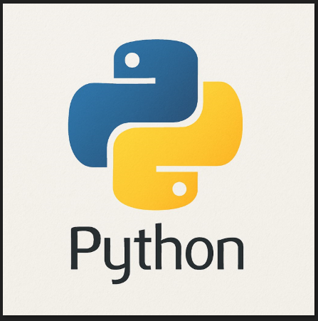
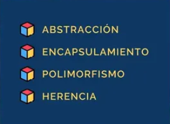

## Clase 1

#Programación Orientada a Objetos

{width=150px height=150px}

# Abstracción

Se centra en las caracteristicas esenciales de algún objeto, en relación a la persperctiva del observador.

atributos: Son las caracteristicas que definen un objeto.

+ Y - atributos: hacen parte de la accesibilidad del objeto, es decir, si son visibles o no.

+ public: Son los atributos que pueden ser accedidos desde fuera de la clase.
- private: Son los atributos que no pueden ser accedidos desde fuera de la clase.

# Herencia 
La herencia te permite reutilizar código y crear nuevas clases que toman las propiedades y comportamientos de clases ya existentes, y luego añadirles los suyos propios.

Imagina que tienes una "clase" (un molde o plantilla) para crear "Animales", y esta clase tiene características como "tener patas" y "hacer un sonido".

Si luego creas una nueva clase llamada "Perro", en lugar de empezar desde cero, puedes decir que "Perro" hereda de "Animal". Esto significa que "Perro" automáticamente ya tiene las características de "tener patas" y "hacer un sonido", sin que tengas que escribirlas de nuevo. Además, puedes añadirle características específicas de un perro, como "ladrar" o "mover la cola".

## Clase 2

# Encapsulamiento

Se refiere a impedir el acceso a determinados métodos y atributos de os objetos estableciendo así que puede utilizarce desde fuera de la clase.

- No existen los modificadores de acceso

# Polimorfismo
- Multiples formas 

Hbabilidad de objetos de distintas clases de responder al mismo mensaje.

Se consigue a travez de la herencia.

En ocaciones se usa ell termino para referirse a la sobrecarga de métodos.

Link pizarra https://zoom.us/wb/doc/oemouhrbQLqWYbfK4ojkOg/p/160916515913728

notion: https://www.notion.so/POO-196bd0f68c8580dabd6be910aac488b5

DevSeniorCode